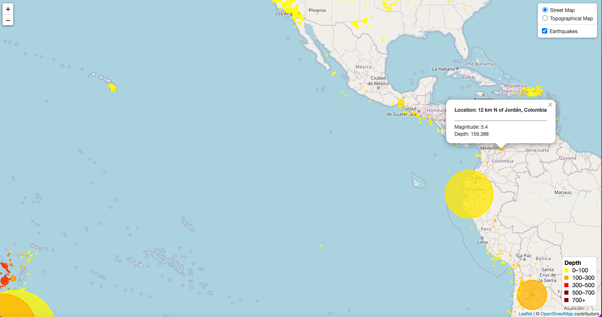

# leaflet-challenge
## Overview
- The index.html file in the repository contains a leaflet map of all earthquake activity globally, in the last month.
- The magnitude and depth of each earthquake is represented by the size and colour of the earthquake's marker respectively. Earthquakes can be toggled on and off in the control panel (top right)
- The geodata for the map is returned from the United States Geological Survey API endpoint. The D3 library is used to retrieve the data in geojson. The API request can be found in `static/js/logic.js` 

## Access and usage
To clone this repository, use the following command:
``
git clone https://github.com/GPN87/leaflet-challenge.git
``